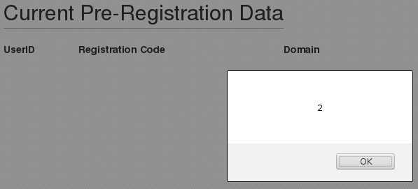
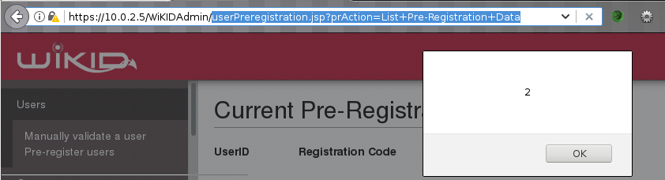

A stored and reflected cross-site scripting vulnerability, CVE-2019-17114, was identified on `WiKID Systems 2FA Enterprise Server` version `4.2.0-b2047` and earlier.  The <var>preRegistrationData</var> parameter, used on **userPreregistration.jsp**, reflects malicious HTML elements contained in an uploaded `.csv`.  The contents of the file are stored and the malicious HTML elements rendered whenever the `List Pre-Registration` functionality is used.  

## Patch

* **4.2.0.b2053**: <https://downloads.wikidsystems.com/wikid-server-enterprise-4.2.0.b2053-1.noarch.rpm>

## Timeline

* 26 Sep 2019 - Issue discovered on `WiKID Systems 2FA Enterprise Server 4.2.0-b2032`
* 29 Sep 2019 - Issue disclosed to WiKID Systems
* 09 Oct 2019 - Issue confirmed by WiKID Systems, Patch released
* XXX Oct 2019 - Public Disclosure

## Description

The source code for **userPreregistrationjsp** reveals the following logic that reads `pre_registration_code` and `name` values from the database and adds them to a string being constructed that will be included in the HTML of the page:

~~~
272                         sb.append("</td><td style=\"padding: 5px;\">")
273                         .append(<r:b>rs.getString("pre_registration_code")</r:b>)
274                         .append("</td><td style=\"padding: 5px;\">")
275                         .append(<r:b>URLDecoder.decode(rs.getString("name"),"UTF-8")</r:b>)
276                         .append("</td></tr>");
~~~

The input is not sanitized, creating a file containing malicious entries such as:

~~~
,
~~~

Will result in the elements  being included in the page when the file is uploaded:

The JavaScript is stored and will trigger whenever `userPreregistration.jsp?prAction=List+Pre-Registration+Data` is visited:

The uploaded elements are visible in the source:

~~~
    <tr><td colspan="2"><h2>Current Pre-Registration Data</h2></td></tr>
          <tr><td><b>UserID</b></td><td><b>Registration Code</b></td><td><b>Domain</b></td></tr>

          <tr  style="padding: 5px;"><td style="padding: 5px;"> (unregistered)
~~~
