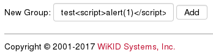
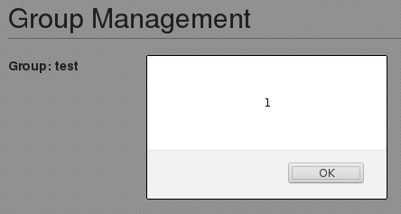
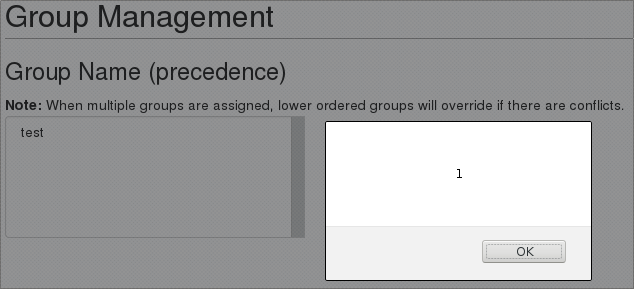

A stored and reflected cross-site scripting vulnerability, CVE-2019-17116, was identified on `WiKID Systems 2FA Enterprise Server` version `4.2.0-b2047` and earlier.  The <var>groupName</var> parameter, used on **groups.jsp**, reflects malicious HTML submitted as **New Group:**.  The malicious elements are stored and rendered whenever **groups.jsp** is visited.  

## Patch

* **4.2.0.b2053**: <https://downloads.wikidsystems.com/wikid-server-enterprise-4.2.0.b2053-1.noarch.rpm>

## Timeline

* 26 Sep 2019 - Issue discovered on `WiKID Systems 2FA Enterprise Server 4.2.0-b2032`
* 29 Sep 2019 - Issue disclosed to WiKID Systems
* 09 Oct 2019 - Issue confirmed by WiKID Systems, Patch released
* 16 Oct 2019 - Public Disclosure

## Description

When a value like  `test` is submitted as the value for **New Group**:

The HTML elements are included in the page and the JavaScript executes immediately:

The <var>groupname</var>  is stored; the name will be included and the JavaScript will trigger when **groups.jsp** is visited:

