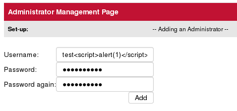
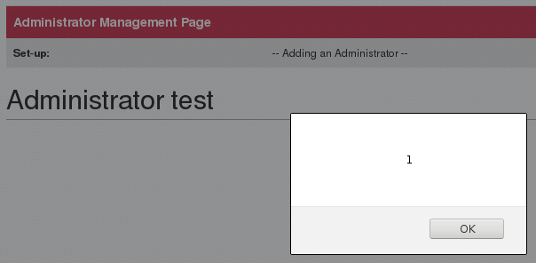
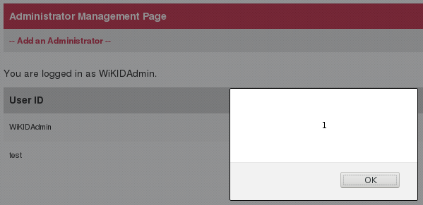

A stored and reflected cross-site scripting vulnerability, CVE-2019-17120, was identified on `WiKID Systems 2FA Enterprise Server` version `4.2.0-b2047` and earlier.  The <var>usr</var> parameter, used by **adm_usrs.jsp**, reflects malicious HTML elements entered as the **Username** for a new admin.  The  malicious HTML elements are rendered whenever the **Administrator Management Page** is visited.  

## Patch

* **4.2.0.b2053**: <https://downloads.wikidsystems.com/wikid-server-enterprise-4.2.0.b2053-1.noarch.rpm>

## Timeline

* 26 Sep 2019 - Issue discovered on `WiKID Systems 2FA Enterprise Server 4.2.0-b2032`
* 29 Sep 2019 - Issue disclosed to WiKID Systems
* 09 Oct 2019 - Issue confirmed by WiKID Systems, Patch released
* 16 Oct 2019 - Public Disclosure

## Description

Creating an admin user with a name like `test`:

Results in the JavaScript being immediately executed:

The malicious name is stored and the JavaScript executed whenever **adm_usrs.jsp** is visited:

