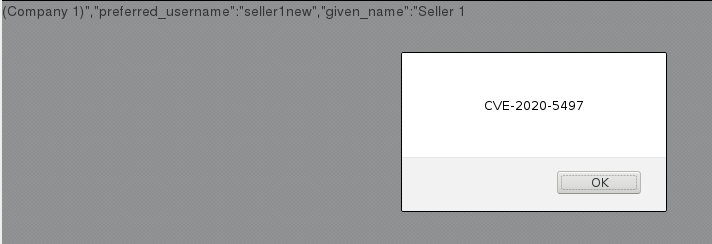

A Cross-Site Scripting issue, CVE-2020-5497, was identified on **MITREid Connect** versions 1.3.3 and earlier due to `userInfoJson` being included in the page unsanitized.

## Vendor Patch

* <https://github.com/mitreid-connect/OpenID-Connect-Java-Spring-Server>

## Timeline

* Identified: 3 Jan 2020
* Initial Developer Contact: 3 Jan 2020
* Issue Disclosed: 3 Jan 2020 - GitHub Issue, 20 Feb 2020 - [Blog post](https://www.securitymetrics.com/blog/MITREid-Connect-cross-site-scripting-CVE-2020-5497)

## Description

A user can modify their name to contain a malicious string like `Test`.  The malicious string is included in the page in multiple places:

~~~{.html}
...
	<!-- use a full user menu and button when not collapsed -->
	<ul class="nav pull-right visible-desktop">

		<li class="dropdown">
			<a id="userButton" class="dropdown-toggle" data-toggle="dropdown" href=""><i class="icon-user icon-white"></i> Test </a>
			<ul class="dropdown-menu pull-right">
				<li><a href="manage/#user/profile" data-toggle="collapse" data-target=".nav-collapse">Test</a></li>
				<li class="divider"></li>
				<li><a href="" data-toggle="collapse" data-target=".nav-collapse" class="logoutLink"><i class="icon-remove"></i> Log out</a></li>
			</ul>
		</li>

	</ul>

	<!--  use a simplified user button system when collapsed -->
	<ul class="nav hidden-desktop">

		<li><a href="manage/#user/profile">Test</a></li>
		<li class="divider"></li>
		<li><a href="" class="logoutLink"><i class="icon-remove"></i> Log out</a></li>
...
~~~

